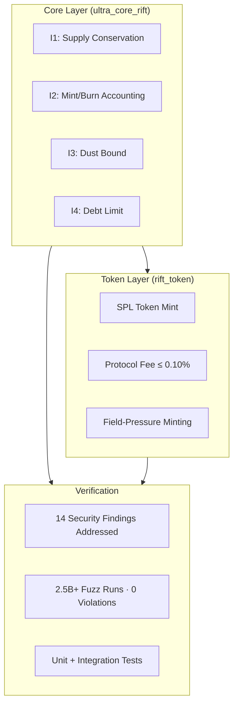
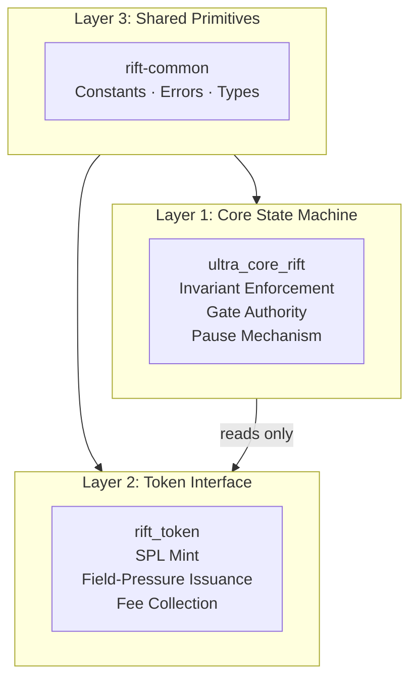

# Rift Network

[](https://github.com/RFT-SIRM/UltraCore-RFT)
[](https://solana.com)
[](https://spl.solana.com)
[](https://www.anchor-lang.com)
[](https://github.com/RFT-SIRM/Rift-Network#-security-model)
[](https://github.com/RFT-SIRM/Rift-Network#-verification)
[](https://github.com/RFT-SIRM/Rift-Network/blob/main/LICENSE)

**Solana On-Chain Protocol · SIRM Invariant Enforcement · SPL Token Layer**

_Part of the [UltraCore RFT](https://github.com/RFT-SIRM/UltraCore-RFT) execution platform_

---

## 🖥️ Live Demo (Devnet)

[](https://rift-network.vercel.app)

A web client for interacting with the on-chain programs is deployed at **[rift-network.vercel.app](https://rift-network.vercel.app)**.


> **Deployment scope:** This repository targets Solana **Devnet**. Mainnet deployment will require an additional security hardening pass, including canonical mint enforcement and stricter authority binding between Core and Token programs.

> ⚠️ **Devnet only.** This interface connects exclusively to Solana **Devnet** — a test network with no real economic value. Wallets and tokens shown are for testing purposes only; do not send real funds. Wallet connection is required to interact with the programs (`register`, `transfer`, `issue_rift`, etc.); all invariant enforcement happens on-chain in the programs listed below.

---

## 🎯 Start Here

| Audience | Document | What You Will Learn |
|---|---|---|
| 🎯 **First-time visitor** | This README | What Rift Network is and how it works |
| 🔬 **Protocol engineer** | [SPEC.md](SPEC.md) | Full engineering specification: invariants, accounts, instructions |
| 🏗️ **Solana developer** | [programs/](programs/) | Anchor implementation of core + token programs |
| 🛡️ **Security researcher** | [Security Model](#-security-model) | 14 findings addressed, invariant enforcement model |

> **One-sentence summary:** Rift Network is a Solana protocol that enforces deterministic economic invariants on-chain through a separated core/token architecture, enabling O(1) supply distribution across any number of participants.

---

## ✨ At a Glance



| Metric | Value |
|---|---|
| **Security Audit Findings** | 14 addressed |
| **Fuzz Runs** | 2.5B+ (0 invariant violations) |
| **Protocol Fee Cap** | 10 bps (0.10%) |
| **Genesis Founder Share** | 3.14% |
| **Soft Launch Window** | 48 hours · 5 SOL per call |
| **License** | Apache 2.0 |
| **Framework** | Anchor 0.30 |

---

## 🌐 What Is Rift Network?

Rift Network is the **on-chain implementation** of the UltraCore RFT execution platform. It is a deterministic economic protocol deployed on Solana that enforces the SIRM mathematical invariants natively on the SVM, with an SPL token interface for participant issuance.

The architecture separates mathematical state from economic interface:



**Key principle:** The token layer never writes to `CoreState`. It reads `global_field` and `paused`, but all invariant logic lives in the core program. A fully compromised token program cannot corrupt the mathematical model — by construction.

---

## 📐 The SIRM Invariants

All state-mutating instructions call `check_invariant()` before returning. There are no execution paths that skip it.

```
I1: total_supply = total_base_sum + global_field × p
I2: total_supply = total_minted − total_burned
I3: dust_accumulator < p   (when p > 0)
I4: effective_balance[i] ≥ −(total_supply / 10p)
```

Where `effective_balance[i] = base_balance[i] + global_field`.

### O(1) Distribution

Standard Solana token distribution requires one account write per participant. Rift does it differently:

```
# Standard: O(N) writes
for each participant:
    balance[i] += reward / N

# Rift: O(1) write
global_field += reward / p   ← one account update, all participants shifted
```

At 1,000,000 participants: Rift uses **1 account write** versus 1,000,000 account writes and CPI calls in the standard approach. This is not an optimization — it is a different mathematical model.

---

## ⚙️ Architecture

### Core Program (`ultra_core_rift`)

**Program ID (Devnet):** `CBrsXBaa1DTHFdCwCkeQHm3bQKRFaWfPx6bKNmM5r5uy`

| Account | Size | Description |
|---|---|---|
| `CoreState` | 145 bytes | Global protocol state; PDA `["core_state"]` |
| `UserAccount` | 56 bytes | Per-participant balance; PDA `["user", authority]` |
| `EdgeAccount` | 24 bytes | Directed edge weight; PDA `["edge", from, to]` |

| Instruction | Authority | Description |
|---|---|---|
| `initialize` | payer | Creates `CoreState` with zero state |
| `set_paused` | gate | Halts all transfers and issuance |
| `register` | gate | Adds participant; preserves I1 |
| `unregister` | gate | Removes participant; burns positive balance |
| `transfer` | from_owner | Peer-to-peer transfer |
| `transfer_with_edge` | from_owner | Transfer with directed burn/mint edge cost |
| `set_edge` | gate | Creates or updates an edge weight |
| `redistribute` | gate | Increases `global_field`; mints supply |
| `apply_neg_entropy` | gate | Deflationary tick; adjusts `total_base_sum` |

### Token Program (`rift_token`)

**Program ID (Devnet):** `GdTffSB1aNxfCeZW3PG2S7c788DnZgduJ68jWak3aJrp`

| Account | Size | Description |
|---|---|---|
| `RiftTokenState` | 156 bytes | Token config; PDA `["rift_token_state"]` |
| SPL Mint | — | Standard SPL mint; authority = PDA `["rift_mint_authority"]` |

| Instruction | Authority | Description |
|---|---|---|
| `initialize` | gate | Creates state; mints 3.14% founder share to admin vault |
| `issue_rift` | user | Mints RIFT shares based on field pressure; collects SOL fee |
| `rebase` | gate | Updates cached `rift_multiplier` from current `global_field` |
| `set_soft_launch_params` | gate | Adjusts soft-launch window limit and duration |

### Mint Formula

```
field_pressure  = max(|global_field|, 10^6)
mint_multiplier = 10^15 / field_pressure
shares_to_mint  = (base_amount - fee) * mint_multiplier / 10^12
```

Higher `|global_field|` → lower multiplier → fewer shares per SOL. The floor at `10^6` caps the multiplier at `10^9` and prevents division-by-zero when `global_field` is near zero.

---

## 🛡️ Security Model

### Findings Addressed

Independent security review completed. 14 findings identified and resolved. Full report available to institutional partners under NDA.

| Category | Count | Status |
|---|---|---|
| Access control | 3 | ✅ Fixed |
| Arithmetic edge cases | 4 | ✅ Fixed |
| PDA validation | 2 | ✅ Fixed |
| State isolation | 2 | ✅ Fixed |
| Error handling | 3 | ✅ Fixed |

Key fixes documented inline in source:

| Tag | Fix |
|---|---|
| `[F-01]` | Recipient ownership verified before any state mutation in `transfer` |
| `[F-02]` | `unregister` checks effective balance (`base + global_field`), not raw `base_balance` |
| `[F-04]` | `issue_rift` rejects micro-amounts where fee rounds to zero (anti-bypass) |
| `[F-05]` | Emits live `mint_multiplier` in events, not the stale cached value |
| `[FUZZ-01]` | `dust_accumulator` renormalised after `p` decrements to preserve I3 |

### Structural Security Properties

- **Invariant enforcement:** `check_invariant()` called after every state-mutating instruction
- **Checked arithmetic:** All operations use `checked_*`; all narrowing casts use `try_into()`
- **Gate authority:** All privileged instructions require gate signer via Anchor `has_one`
- **Pause coverage:** `paused = true` blocks transfers and issuance across both programs
- **CoreState binding:** `RiftTokenState` stores the bound `CoreState` address at init; every token instruction verifies it on-chain
- **Mint constraint:** `admin_vault_token_account.mint == rift_mint` enforced at `initialize`
- **Owner constraint:** `user_token_account.owner == user` enforced at `issue_rift`
- **Soft launch:** 48-hour window with 5 SOL per-call cap limits early exposure

---

## ✅ Verification

| Layer | Method | Status |
|---|---|---|
| L1 — Formatting | `cargo fmt --all` | Every push · CI enforced |
| L2 — Lint | `cargo clippy` (rift-common, rift-integration-tests, rift_token) | Every push · CI enforced |
| L3 — Unit tests | `cargo test -p rift_token` — 8 tests on mint formula | Every push · CI enforced |
| L4 — Program tests | `cargo test -p ultra_core_rift -p rift-integration-tests -p rift-common` | Every push · CI enforced |
| L5 — Fuzzing | 2.5B+ runs, all four protocol modes | Daily · 0 invariant violations |
| L6 — Audit | Independent security review | 14 findings addressed |
| L7 — On-Chain | Reproducible build via `solana-verify` | Hashes verified on-chain |

### On-Chain Program Hashes (Devnet)

| Program | Program ID | SHA-256 |
|---|---|---|
| `ultra_core_rift` | `CBrsXBaa1DTHFdCwCkeQHm3bQKRFaWfPx6bKNmM5r5uy` | `f5b82e461c0bd81363c863e7f9ca558f1eae71d8bedeec7a74fbd790a82ab7cf` |
| `rift_token` | `GdTffSB1aNxfCeZW3PG2S7c788DnZgduJ68jWak3aJrp` | `47b5f15c22a693362d7784acdfedfb304d3ed22871be399c24e57d347c57f9e4` |

Verify yourself:

```bash
solana-verify get-program-hash CBrsXBaa1DTHFdCwCkeQHm3bQKRFaWfPx6bKNmM5r5uy \
  --url https://api.devnet.solana.com

solana-verify get-program-hash GdTffSB1aNxfCeZW3PG2S7c788DnZgduJ68jWak3aJrp \
  --url https://api.devnet.solana.com
```

---

## 🚀 Quick Start

### Prerequisites

- Rust 1.85.1+
- Solana CLI
- Anchor CLI 0.30

### Build

```bash
cargo build --workspace
anchor build
```

### Test

```bash
# Unit tests — rift_token mint formula (8 tests)
cargo test -p rift_token

# Core program tests
cargo test -p ultra_core_rift

# Integration tests
cargo test -p rift-integration-tests

# Shared primitives
cargo test -p rift-common
```

### Format & Lint

```bash
cargo fmt --all
cargo clippy -p rift-common -p rift-integration-tests -p rift_token \
  --all-targets -- -D warnings -A unexpected-cfgs
```

---

## 🔗 Ecosystem

| Repository | Role |
|---|---|
| [UltraCore-RFT](https://github.com/RFT-SIRM/UltraCore-RFT) | Central laboratory and documentation |
| [Rift-L1-Blockchain](https://github.com/RFT-SIRM/Rift-L1-Blockchain) | Standalone Rust validator; same SIRM invariants, different runtime |

---

## 📋 License

[](https://github.com/RFT-SIRM/Rift-Network/blob/main/LICENSE)

**[Apache License 2.0](LICENSE)**

---

**Built in Rust · Verified by Mathematics · Zero Compromises**

_Part of the UltraCore RFT Execution Platform · © 2026 Eugeny (RFT-SIRM)_
