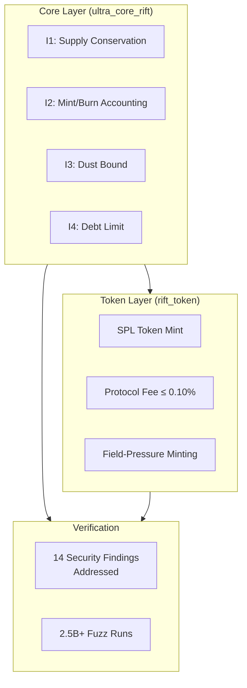
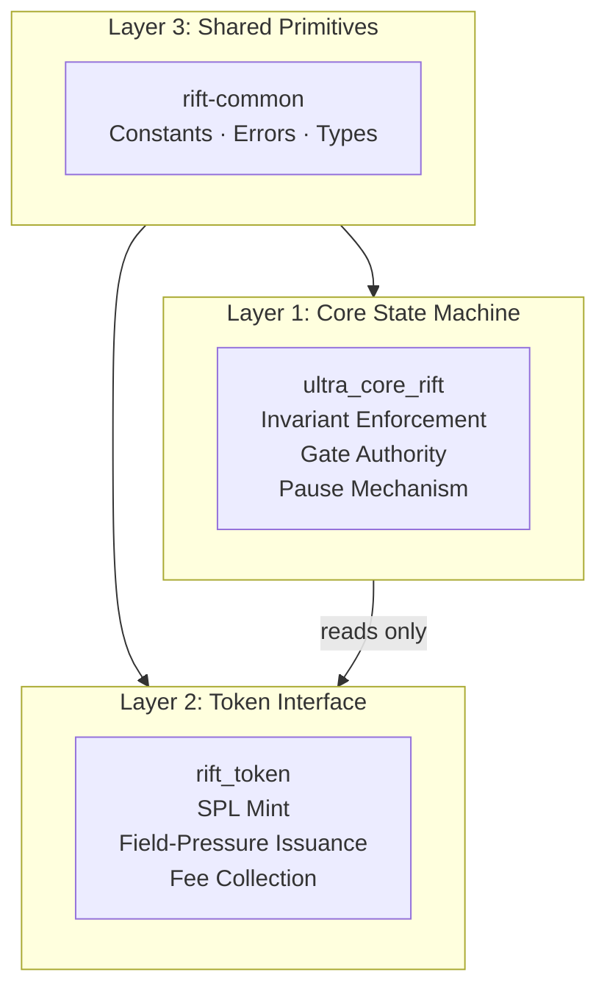
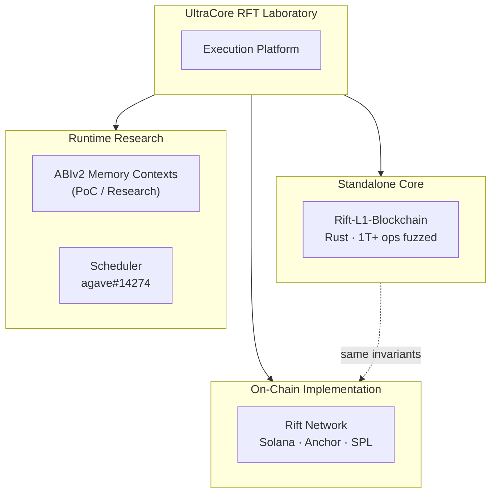

# Rift Network

[](https://github.com/RFT-SIRM/UltraCore-RFT)
[](https://solana.com)
[](https://spl.solana.com)
[](https://www.anchor-lang.com)
[](https://github.com/RFT-SIRM/Rift-Network#-security-model)
[](https://github.com/RFT-SIRM/Rift-Network#-verification)
[](https://github.com/RFT-SIRM/Rift-Network/blob/main/LICENSE)

**Solana On-Chain Protocol · SIRM Invariant Enforcement · SPL Token Layer**

_Part of the [UltraCore RFT](https://github.com/RFT-SIRM/UltraCore-RFT) execution platform_

* * *

## 🎯 Start Here

| Audience | Document | What You Will Learn |
| --- | --- | --- |
| 🎯 **First-time visitor** | This README | What Rift Network is and how it fits into UltraCore |
| 🔬 **Protocol engineer** | [SPEC.md](SPEC.md) | Full engineering specification: invariants, accounts, instructions |
| 🏗️ **Solana developer** | [programs/](programs/) | Anchor implementation of core + token programs |
| 🛡️ **Security researcher** | [Audit & Verification](#-security-model) | 14 findings addressed, invariant enforcement model |

> **One-sentence summary:** Rift Network is a Solana protocol that enforces deterministic economic invariants on-chain through a separated core/token architecture — the on-chain implementation of the UltraCore execution platform.

* * *

## ✨ At a Glance



| Metric | Value |
| --- | --- |
| **Security Audit Findings** | 14 addressed |
| **Fuzz Runs** | 2.5B+ |
| **Protocol Fee Cap** | 10 bps (0.10%) |
| **Genesis Founder Share** | 3.14% |
| **License** | Apache 2.0 |
| **Framework** | Anchor |

* * *

## 🌐 What Is Rift Network?

Rift Network is the **on-chain institutional layer** of the UltraCore RFT execution platform. It is not a standalone token project. It is a deterministic economic protocol deployed on Solana that enforces the same SIRM invariants as the standalone [Rift L1 Blockchain](https://github.com/RFT-SIRM/Rift-L1-Blockchain) — but adapted for the Solana Virtual Machine and SPL token standard.

The architecture separates mathematical state from economic interface:



**Key principle:** The token layer never writes to `CoreState`. It reads `global_field` and `paused`, but all invariant logic lives in the core program. This separation means the SPL token interface cannot corrupt the mathematical model — by construction.

* * *

## 📐 The SIRM Model On-Chain

All RFT-SIRM systems share a single mathematical foundation. Rift Network implements it as a Solana program:

```
I1: total_supply = total_base_sum + global_field × p
I2: total_supply = total_minted − total_burned
I3: dust_accumulator < p (when p > 0)
I4: effective_balance[i] ≥ −(total_supply / 10p)
```

Where `effective_balance[i] = base_balance[i] + global_field`.

### O(1) Distribution on Solana

Standard Solana token distribution:
```
for each participant:
 balance[i] += reward / N ← O(N) CPI calls, O(N) rent
```

Rift approach:
```
global_field += reward / p ← O(1), one account update, all participants
```

At 1,000,000 participants on Solana:
- Standard: 1,000,000 account writes, 1,000,000 CPI calls, prohibitive rent
- Rift: **1 account write, 0 CPI calls**

This is not an optimization. It is a different mathematical model that makes large-scale distribution economically viable on Solana.

* * *

## ⚙️ Architecture

### Core Program (`ultra_core_rift`)

| Account | Size | Description |
| --- | --- | --- |
| `CoreState` | 145 bytes | Global protocol state (not a PDA) |
| `UserAccount` | 56 bytes | Per-participant balance; PDA `["user", authority]` |
| `EdgeAccount` | 24 bytes | Directed edge weight; PDA `["edge", from, to]` |

| Instruction | Authority | Description |
| --- | --- | --- |
| `initialize` | payer | Creates `CoreState` with zero state |
| `set_paused` | gate | Halts all transfers |
| `register` | gate | Adds participant; preserves I1 |
| `unregister` | gate | Removes participant; burns positive balance |
| `transfer` | from_owner | P2P transfer |
| `transfer_with_edge` | from_owner | Transfer with directed burn/mint cost |
| `set_edge` | gate | Creates or updates edge weight |
| `redistribute` | gate | Increases `global_field`; mints supply |
| `apply_neg_entropy` | gate | Deflationary tick; adjusts `total_base_sum` |

### Token Program (`rift_token`)

| Account | Size | Description |
| --- | --- | --- |
| `RiftTokenState` | 132 bytes | Token config; PDA `["rift_token_state"]` |
| SPL Mint | — | Standard SPL mint; authority = PDA `["rift_mint_authority"]` |

| Instruction | Authority | Description |
| --- | --- | --- |
| `initialize` | gate | Creates state; mints 3.14% founder share |
| `issue_rift` | user (pays SOL) | Mints RIFT shares based on field pressure |
| `rebase` | gate | Updates cached `rift_multiplier` |

### Mint Formula

```
field_pressure = max(|global_field|, MIN_FIELD_PRESSURE)
mint_multiplier = 1_000_000_000_000_000 / field_pressure
shares_to_mint = (base_amount − fee) × mint_multiplier / 1_000_000_000_000
```

`MIN_FIELD_PRESSURE = 10^6` caps the multiplier at `10^9`. Higher field pressure → fewer shares per unit. The formula is monotonically decreasing in `|global_field|`.

* * *

## 🛡️ Security Model

### What Was Audited

Independent security audit completed. 14 findings identified and addressed. Full report available to partners under NDA. Summary of addressed categories:

| Category | Count | Status |
| --- | --- | --- |
| Access control gaps | 3 | Fixed |
| Arithmetic edge cases | 4 | Fixed |
| PDA validation | 2 | Fixed |
| State isolation | 2 | Fixed |
| Error handling | 3 | Fixed |

### Invariant Enforcement

- **Hard constraints:** `check_invariant()` runs after every state-mutating instruction
- **Checked arithmetic:** All ops use `checked_add`, `checked_sub`, `checked_mul`, `checked_div`
- **Gate authority:** All privileged ops require gate signer; enforced via Anchor `has_one`
- **Pause coverage:** When `paused = true`, all transfers and issuance are rejected
- **CoreState binding:** `RiftTokenState` stores the bound `CoreState` address; every token instruction verifies it

### Separation of Concerns

The token program is a **read-only consumer** of core state. It:
- Reads `global_field` and `paused`
- Calls `CoreState.check_invariant()`
- **Never writes to `CoreState`**

This means even a fully compromised token program cannot violate the core invariant — the architecture prevents it structurally.

* * *

## ✅ Verification

| Layer | Method | Evidence |
| --- | --- | --- |
| L1 — Static | Clippy, rustfmt, cargo-audit | Every push |
| L2 — Unit | Workspace tests (excluding Anchor programs) | `cargo test --workspace` |
| L3 — Fuzzing | 2.5B+ runs across protocol modes | 0 invariant violations |
| L4 — Audit | Independent security review | 14 findings addressed |

* * *

## 🚀 Quick Start

### Prerequisites

- Rust toolchain
- Solana CLI
- Anchor CLI

### Build

```bash
cargo build --workspace
```

### Test

```bash
# Workspace tests (excludes Anchor programs)
cargo test --workspace --exclude ultra_core_rift --exclude rift_token
```

### Format & Lint

```bash
cargo fmt --all
cargo clippy --workspace --exclude ultra_core_rift --exclude rift_token --all-targets --all-features -- -D warnings -A unexpected-cfgs
```

* * *

## 🔗 Ecosystem Context



| Repository | Role | Relation to Rift Network |
| --- | --- | --- |
| [UltraCore-RFT](https://github.com/RFT-SIRM/UltraCore-RFT) | Central laboratory & documentation | Parent organization |
| [Rift-L1-Blockchain](https://github.com/RFT-SIRM/Rift-L1-Blockchain) | Standalone Rust validator core | Same invariants, different runtime |
| [agave-abiv2-memory-contexts](https://github.com/RFT-SIRM/agave-abiv2-memory-contexts) | SVM memory isolation research (PoC) | Complementary runtime research |
| [agave-rift-scheduler](https://github.com/RFT-SIRM/agave-rift-scheduler) | Conflict-aware scheduling | Complementary runtime research |

* * *

## 📋 License

[](https://github.com/RFT-SIRM/Rift-Network/blob/main/LICENSE)

 **[Apache License 2.0](LICENSE)**

* * *

**Built in Rust · Verified by Mathematics · Zero Compromises**

_Part of the UltraCore RFT Execution Platform · © 2026 Eugeny (RFT-SIRM)_
